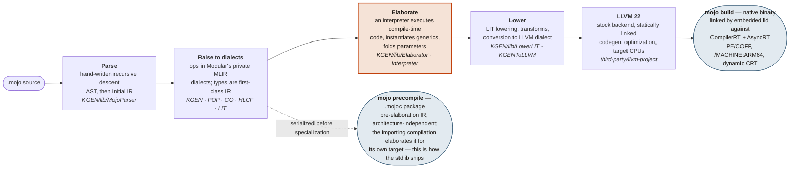
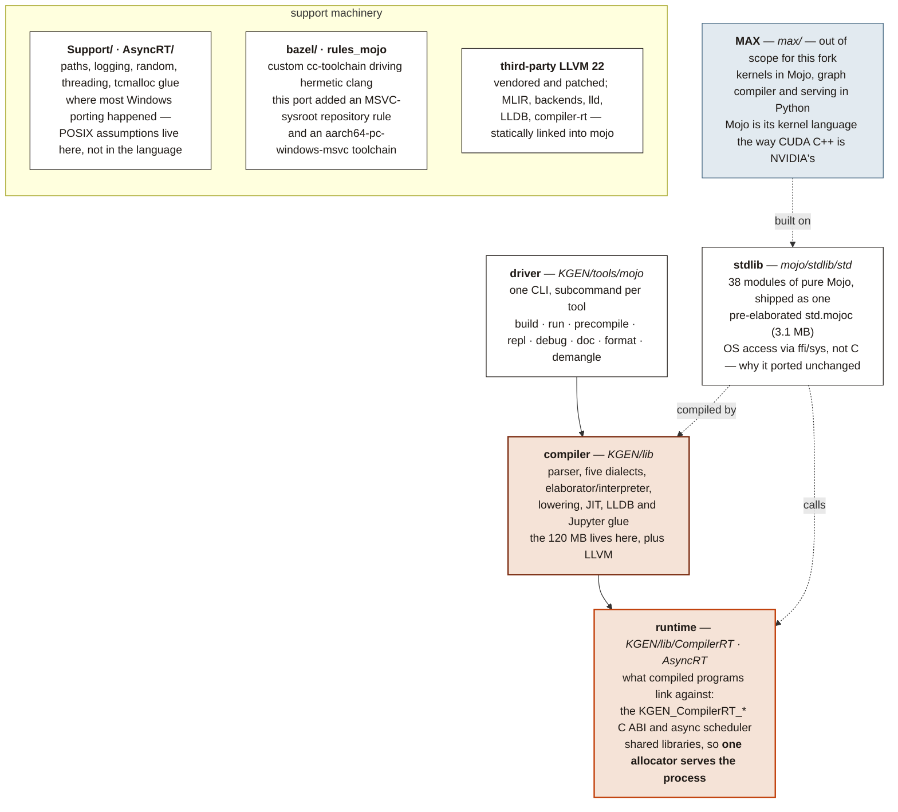
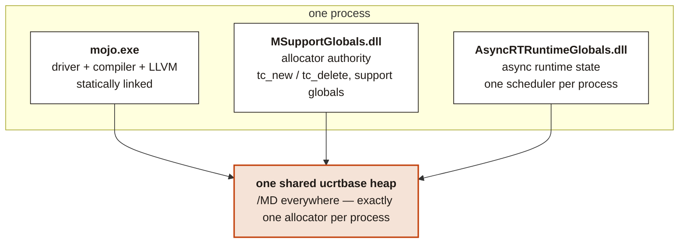

# WINMOJO — Mojo 1.1 on native Windows ARM64

## Thanks, and a statement of intent

Mojo is a serious piece of language engineering, and it was given away. Thanks
are owed to Chris Lattner and the team at Modular who designed and built it, and
to everyone who has contributed to the compiler and the standard library since.

Open-sourcing the compiler and stdlib under Apache 2.0 — with a patent grant and
no field-of-use restriction — is what makes a port like this one both legal and
possible. It means someone can take the source, aim it at hardware the authors
never targeted, and find out what happens. That is not the industry norm, and it
is the reason this repository can exist at all.

What follows is not written in a spirit of celebration, and it would be dishonest
to pretend otherwise.

This repository exists to run Mojo on my own hardware, to understand how it
works, and to find out whether it is useful to me. It is not a tribute and not an
advertisement. Much of what is recorded here — in this README and at far greater
length in the [journal](PORT-JOURNAL.md) — is blunt about the language, the
toolchain, and the licensing, and it will stay blunt wherever the evidence points
that way. That is the point of the exercise rather than a failure of manners:
**I am interested; I am not a fan.**

## What this is

**An unofficial, unsupported fork of [modular/modular](https://github.com/modular/modular)
that ports the Mojo compiler and standard library to native Windows 11 on
Snapdragon (ARM64) PCs.**

No WSL. No emulation in the shipped binary. `mojo.exe` is a PE/COFF ARM64
executable that compiles and runs `.mojo` files on the machine you are sitting at.

> [!IMPORTANT]
> This is not a Modular product and is not affiliated with, endorsed by, or
> supported by Modular. Do not file issues about this fork on the upstream
> repository. It carries no warranty and no support commitment of any kind.
> If you need supported Mojo, use [the real thing](https://mojolang.org) on a
> platform Modular actually ships for.

| | |
| --- | --- |
| **Upstream** | `modular/modular` @ `f66d4d5` |
| **Language version** | Mojo 1.1.0 — **frozen, see below** |
| **Target** | `aarch64-pc-windows-msvc`, Windows 11, Snapdragon X |
| **Scope** | Mojo compiler (KGEN), C++ substrate, stdlib, CPU codegen |
| **Out of scope** | MAX (kernels, graph, engine, serve), GPU backends |
| **Licence** | Apache 2.0 with LLVM exceptions (compiler & stdlib) |

## The irony

Mojo exists because AI compute is heterogeneous. Its entire premise is that one
source file should specialize to whatever silicon you point it at — CPUs, GPUs,
accelerators, NPUs.

Snapdragon X is an AI PC. It has a capable ARM64 CPU, an Adreno GPU, and a
Hexagon NPU sitting right there. It is precisely the sort of heterogeneous
consumer silicon Mojo was designed to talk to.

Mojo does not support it. Modular ships Linux x86-64, Linux ARM64, and macOS
ARM64. On Windows the official answer is WSL — a Linux VM, on a machine whose
native ISA is already ARM64, to run a language whose reason for existing is
meeting hardware where it lives.

This fork exists to close that gap for one machine. That is the whole ambition.
It is not a bid to become the Windows port.

## The freeze

**When this port is complete it stays at Mojo 1.1.0. It does not track upstream.**

That is a deliberate design decision, not neglect. A solo port cannot chase a
language that redefines itself every few weeks: every upstream churn re-keys the
build, invalidates substrate work, and moves the finish line. Pinning to a single
commit turns an infinite task into a finite one.

What that buys:

- **A finishable artifact.** The target is fixed, so "done" is a state that can
  actually be reached and then verified.
- **A stable language to write against.** Code written for this compiler keeps
  compiling. No deprecation treadmill, no syntax that evaporates next release.
- **Reproducibility.** One upstream commit, one toolchain, one answer to "why did
  this change?"

What that costs, stated plainly: no upstream bug fixes, no new language features,
no new stdlib APIs, and a growing distance from whatever Mojo becomes. This is a
preserved snapshot of a language at version 1, not a living distribution. If that
trade is wrong for you, this fork is wrong for you.

## Status

Full stdlib test census, native Windows ARM64:

| Result | Targets |
| --- | --- |
| pass | **207** |
| fail | 89 |
| fail to build | 15 |
| skipped (platform-gated) | 55 |
| **total** | **366** |

`mojo.exe` builds, links, parses, compiles and runs Mojo. The stdlib compiles to
`std.mojoc` with warnings only and required no source changes. The remaining
failures are the current work; see [PORT-JOURNAL.md](PORT-JOURNAL.md) for the
running record, which is where the real detail lives.

### What works, and what does not

| | State |
| --- | --- |
| `mojo build` (AOT) | **works** — produces a running native ARM64 PE/COFF binary |
| `mojo run` / REPL (JIT) | **cannot work** — LLVM has no COFF/ARM64 JITLink backend |
| native CPU target | **broken** — `oryon-1` crashes the compiler, see below |
| standalone driver | works only with two environment overrides, see below |

Two defects had to be fixed before any Mojo program could be compiled and run on
this platform. The COFF machine type was hardcoded to `/machine:X64` — carrying
upstream's comment *"Mojo only supports X86_64 COFF right now"* — so the linker
was handed ARM64 objects and told they were x86-64. With that derived from the
target triple, the link reached symbol resolution and failed on `write` and
`dup`: the stdlib's FFI calls POSIX names that the MSVC CRT exports
underscore-prefixed, and `oldnames.lib` supplies the aliases that `cl.exe` would
normally request through a `/DEFAULTLIB` directive Mojo never emits.

Three gaps remain worked around rather than fixed:

- **The compiler cannot target this machine's CPU.** `oryon-1` — the actual
  Snapdragon X core — hits an assertion in LLVM's AArch64 scheduling model
  (`TargetSchedule.cpp:227`, "incomplete machine model") and aborts codegen
  outright. Everything below was compiled for `neoverse-n1` instead. Both are
  ARMv8-A AArch64 and neither has SVE, so the substitution is sound and the code
  is correct and native — but it is scheduled for a narrower core than the one
  running it. A compiler that crashes on its own host CPU is a defect, not a
  footnote, and it is the next thing to fix.
- **The compiler_rt default path is Linux-shaped**
  (`lib/libKGENCompilerRTShared.so`), so `MODULAR_MOJO_MAX_COMPILERRT_PATH` must
  be set for a standalone invocation. Bazel-driven builds resolve it via runfiles
  and are unaffected.
- **The linker driver must be named explicitly** through
  `MODULAR_MOJO_MAX_LINKER_DRIVER`, since the driver emits MSVC-style flags and
  looks for `link.exe` on PATH.

### First benchmarks

Six programs, transliterated line-for-line into Mojo, C and Python, run on one
Snapdragon X desktop. C is clang 22.1.4 at `-O3` — the same LLVM version Mojo
itself uses — and both were given the same `-mcpu`. Times in milliseconds,
in-process, excluding startup.

| Benchmark | Mojo | C | CPython 3.12 | vs C |
| --- | --- | --- | --- | --- |
| fib30 · recursion | 2 | 2 | 165 | 1.00× |
| mandelbrot · float | 21 | 19 | 1157 | 1.11× |
| collatz · int div | 70 | 24 | 2284 | 2.92× |
| sieve5m · memory | 27 | 13 | 1167 | 2.08× |
| matmul256 · cache | 6 | 3 | 2277 | 2.00× |
| qsort1m · branchy | 77 | 67 | 2478 | 1.15× |
| **geometric mean** | | | | **1.58×** |

Mojo comes out around **65× faster than CPython and 1.6× slower than C**. Only
the second number means anything: beating a bytecode interpreter by two orders of
magnitude is the entry fee for any compiled language, not a result worth
reporting. The spread against C — 1.0× on pure call overhead, 2.9× on a tight
integer-division loop — is where the actual information is.

Caveats that matter before anyone quotes these: the CPU target is wrong for both
languages (above); `fib30` and `matmul256` are near timer resolution; mandelbrot
is numerically chaotic and all three languages return slightly different counts,
so it measures speed and not correctness; and none of Mojo's actual selling
points — SIMD, `parallelize`, GPU — are exercised at all. This is scalar
single-threaded codegen, the part Mojo shares with every other LLVM language.

### Building

Requires Windows 11 ARM64, Visual Studio Build Tools (for the MSVC sysroot), and
**Developer Mode enabled** — that last one is not optional, and the journal entry
*`ln -s` lies* explains why it is load-bearing.

```bash
.\bazelw.cmd build //KGEN/tools/mojo:mojo
```

---

# Anatomy of Mojo

*What one 120 MB compiler binary actually contains, how a `.mojo` file becomes
machine code, and where the runtime, standard library, and MAX fit around it —
as found in the source tree during this port.*

| | |
| --- | --- |
| **1** | binary: `mojo` — driver, parser, compiler, JIT, REPL, LSP |
| **120 MB** | `mojo.exe`, with LLVM + MLIR statically inside |
| **5** | private MLIR dialects (KGEN, POP, CO, HLCF, LIT) |
| **38** | stdlib modules, pure Mojo, zero C in the library itself |
| **322** | stdlib test files |

## Part I — What Mojo is

Mojo is a systems programming language wearing Python's syntax. Functions,
structs, traits, and generics compile to native code with no interpreter and no
GC, and ownership and borrow semantics do the memory management. Older writing
about Mojo describes a Python-style `def` coexisting with a systems-style `fn`;
that is no longer true at this version, which rejects `fn` with *"'fn' has been
removed; use 'def' instead"*. It is not an isolated case — see
[language drift](docs/LANGUAGE-DRIFT.md) for the full list of constructs the
documentation still teaches and this compiler refuses. It was built by Modular as the language
for writing AI kernels — code that must run on CPUs, GPUs, and accelerators from
one source — and that origin explains its two defining traits.

First, it is **MLIR-native**. Where most languages lower their AST to LLVM IR
directly, Mojo parses into Modular's own MLIR dialects and does nearly all of its
work — metaprogramming, generics, optimization — as MLIR transformations. LLVM
only sees the final, fully-specialized result.

Second, **compile-time execution is the metaprogramming system**. There is no
separate template or macro language: `@parameter` code, generic instantiation,
and constant evaluation all run in a built-in interpreter that executes the same
IR the compiler is building. Types are values at compile time.

The consequence is the unusual shape of the distribution: one large binary
containing a full compiler stack, plus a small runtime the generated code calls
into, plus a standard library written entirely in Mojo itself.

## Part II — From source to machine code



JIT variants of the same pipeline back `mojo run` and the REPL
(`KGEN/lib/ExecutionEngine`).

**Why the elaborator is the hot stage:** generic instantiation by compile-time
interpretation is what lets one kernel source specialize for any target, and it
is why a `.mojoc` is portable while a `.o` is not. It is also why the compiler
needs its runtime present at build time — compile-time code allocates through the
same `KGEN_CompilerRT` ABI that compiled programs use at run time.

## Part III — How the repository composes



## Part IV — The process, on Windows

Upstream builds the runtime globals as shared libraries for a reason: TCMalloc
state, runtime configuration, and the allocator must exist *once* per process, no
matter how many components link them. On Linux and macOS a single libc makes that
automatic. On Windows it became the port's hardest bug: clang's default static
CRT gave every module a private heap, and cross-module frees corrupted memory
nondeterministically at teardown. The fix — `-fms-runtime-lib=dll` — restores the
intended topology.



**Rule this port enforces:** memory may be allocated in any module and freed in
any other, so every module must share the dynamic CRT. Static-CRT builds of this
codebase are not a packaging choice — they are undefined behaviour.

## Part V — Where the port stands

| Milestone | State |
| --- | --- |
| toolchain | Hermetic clang 22 targeting `aarch64-pc-windows-msvc`, MSVC sysroot via vswhere, GNU-style flags against the MSVC ABI — the same architecture as Modular's Linux and macOS toolchains. |
| dependencies | LLVM, MLIR, gRPC, protobuf, abseil, boringssl, curl, zlib-ng all compile. |
| `mojo.exe` | Builds, links, parses and compiles Mojo on Windows ARM64. |
| stdlib | Compiles to `std.mojoc` with warnings only — no source changes required. |
| tests | 207 of 366 targets pass; 89 fail, 15 fail to build, 55 platform-skipped. |
| next | Drive down the failures, then performance against CPython. |

> **Reading the tree yourself?** Start at `KGEN/tools/mojo/mojo.cpp` and follow a
> subcommand into `KGEN/lib`. The dialect TableGen files under
> `KGEN/include/KGEN` are the closest thing to a language-internals reference
> that exists.

---

## Licence and attribution

The Mojo compiler (`KGEN/`), the substrate, and the standard library are Apache
2.0 **with LLVM exceptions**, and this fork inherits that licence — permissive,
with a patent grant, and binary attribution waived. That is precisely why the
scope line is drawn where it is.

MAX (`max/`) is under the Modular Community License and is **out of scope** for
this fork. Scoping to compiler and stdlib keeps this work wholly inside
Apache 2.0.

Upstream is [modular/modular](https://github.com/modular/modular). All original
design credit belongs to Modular; the errors in this port are mine.

---

# The licence traps, and why they miss this work

Modular's licensing is not one document but three, and most confusion about what
you may do with Mojo comes from reading the wrong one. The traps in the stack are
real, sharply drawn, and — for a project built the way this one is — inapplicable.
The reasoning is worth writing down, because it is also the reason this repository
is built the way it is.

## Three instruments, and which governs what

| Instrument | Governs | Reach here |
| --- | --- | --- |
| **Apache 2.0 + LLVM exceptions** | the per-file source: the compiler, and 4,585 files under `max/` by header count | **this is what we use** — irrevocable, commercial use fine, derivatives fine, no hardware or field-of-use limits |
| **Community License** | Modular's **binary** SDK distributions | never invoked — no binaries used |
| **Terms of Use** | the hosted platform and accounts | never invoked — no account |

Decisively, the Community License itself concedes the point: for Apache-licensed
components, Apache **"controls over these Terms in the event of any conflict."**
The permissive grant on the source is not overridden by the terms attached to the
binaries.

## The trap, confirmed and dated

`Licenses/LICENSE` in this tree is the Community License, **Last Modified:
August 17, 2026**, and it contains — verbatim, verifiable in the file:

- **Commercial use unlimited on x86/ARM CPUs and NVIDIA hardware, capped at
  eight (8) accelerator devices for everything else.** Adreno and Hexagon are
  neither CPUs nor NVIDIA. Snapdragon is precisely the monetised class:
  free-on-NVIDIA to fight CUDA, pay-to-play everywhere else.
- **Distributed applications "must only be run on hardware expressly supported by
  MAX"** — custom hardware requires Modular's written permission "in its sole
  discretion." A Snapdragon port would literally have to ask.
- **A non-compete attached to the language**: you may not "develop an Application
  in Mojo, for any Competitive Activity."
- **A preamble** claiming the Terms bind anyone "developing software using... [the]
  Mojo programming language" at all.
- Plus mandatory logo rights for commercial users, telemetry, and a reserved right
  to begin charging.

## Then it changed, one day later

The website version is dated **August 18** and removed every one of those clauses.
Modular's own FAQ concedes it: the old licence *"capped free production use at
eight accelerators outside x86, ARM and NVIDIA... Both requirements are now gone."*
That has the unmistakable rhythm of a backlash correction. This tree still carries
the stale, harsher text — which is why the dated quotation above matters.

## The trap moved rather than died

The replacement is aimed squarely at AI-assisted reimplementation. New **§1.3**
forbids using MAX as AI input *"to produce software that reimplements or
substitutes for MAX."* The Terms of Use add the concept of an **"AI-Derived
Work"** — sweeping in *"translations, ports, transpilations, refactorings"*
performed by AI, with explicit language that clean-room separation is **no
exemption** if Modular IP was "input, reference, or inspiration."

That clause describes this project's genus with uncomfortable precision, and it
should be read carefully rather than waved away.

## Why it does not reach us

Both instruments bind on **using Modular's binaries or hosted platform**. This
project never has:

- **No account.** Nothing was ever accepted, clicked through, or signed.
- **No wheel, no prebuilt toolchain.** Not one Modular binary has entered the
  tree. On Windows ARM64 that was never even possible — a constraint that turns
  out to be legally convenient.
- **Everything descends from per-file Apache source**, whose grant Modular's own
  supremacy clause concedes controls.

And even the new §1.3 carves out *"develop[ing] Your own software that runs on or
interoperates with MAX."* An ABI-compatible runtime is interoperation by
definition.

The journal's day-by-day provenance record turns out to be evidence, not merely a
diary.

## The bright line

> **Never introduce Modular binaries, wheels, or accounts into this project.**

The moment one is used, the AI clauses attach — and they attach to a person, not
to a repository. Staying binary-free costs nothing: everything measured here was
obtained without them.

## Two residual flags

- **Trademarks are a separate axis** from copyright licensing. Names that lead
  with Modular's mark are the exposure; "MAX-compatible" in prose is defensible
  nominative use. Renaming is cheap now and expensive later, if any of this ever
  acquires commercial weight.
- **Qualcomm's QAIRT `LICENSE.pdf`** is the other licence in the stack.
  Irrelevant to the CPU and GPU lines, but it is the document to read before any
  NPU work ships Qnn DLLs inside a product.

## Caveat, honestly meant

I am not a lawyer and this is not legal advice. The structural read is solid,
quoted from the file in this tree, and dated — but it is a careful engineer's
reading, not counsel. Anyone attaching commercial weight to this work should get
a real opinion.
